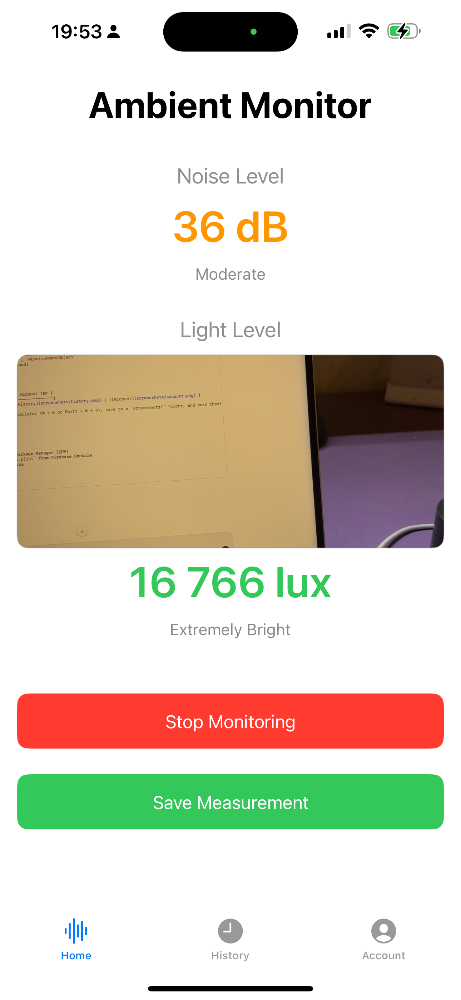
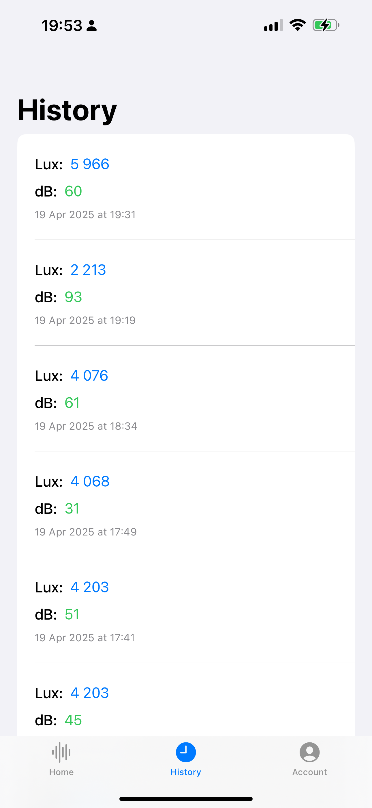
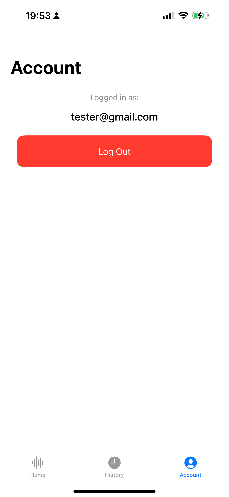

# AmbientSense 📱🔆🔊

**AmbientSense** is an iOS app built with SwiftUI that monitors and displays **ambient light** and **environmental noise** levels using device sensors. It allows users to view real-time readings, store historical data, and track their environmental exposure — all with a clean, native iOS experience.

---

## ✨ Features

- 🔐 **User Authentication** with Firebase (Email/Password)
- 🔊 **Real-Time Sound Level Monitoring** (dB)
- 🔆 **Ambient Light Detection** (lux) using camera session
- ☁️ **Cloud Sync with Firestore** – saves each measurement (lux, dB, timestamp)
- 📜 **History View** – see all previous measurements with timestamps
- 👤 **Account Tab** – view user info, logout
- 🧭 **Tab Navigation** – clean and intuitive Home, History, and Account tabs
- 🔄 **Persistent Login** – user stays logged in until manually logged out

---

## 🛠 Tech Stack

- **Language**: Swift 5
- **Framework**: SwiftUI
- **Architecture**: MVVM
- **Backend**: Firebase (Auth + Firestore)
- **State Management**: `@StateObject`, `@EnvironmentObject`
- **Storage**: Firebase Firestore (cloud)

---

## 🖼 Screenshots

| Home (Monitoring) | History View | Account Tab |
|-------------------|--------------|--------------|
|  |  |  |
---

## 🚀 Getting Started

1. Clone this repo
2. Open in Xcode (15+ recommended)
3. Run `pod install` or use Swift Package Manager (SPM)
4. Add your own `GoogleService-Info.plist` from Firebase Console
5. Build and run on a real iOS device

---

## 📦 Folder Structure

AmbientSense/  
├── Models/  
├── ViewModels/  
├── Views/  
├── Resources/  
├── Assets.xcassets/  
├── AmbientSenseApp.swift  

---

## 📌 TODO / Future Improvements

- [ ] PDF/CSV Export of measurements
- [ ] Chart view for data visualization
- [ ] Custom alerts for high noise levels
- [ ] Dark Mode support
- [ ] Local notifications (optional)

---

## 📣 Author

Made with ❤️ by Muntahaa Khan  
> 🔗 LinkedIn: [khan-muntahaa-85a136b5](https://www.linkedin.com/in/khan-muntahaa-85a136b5/)  
> 💻 GitHub: [Pasha-007](https://github.com/Pasha-007)

---

## 🪄 License

MIT License — feel free to use, build on, or improve it!
